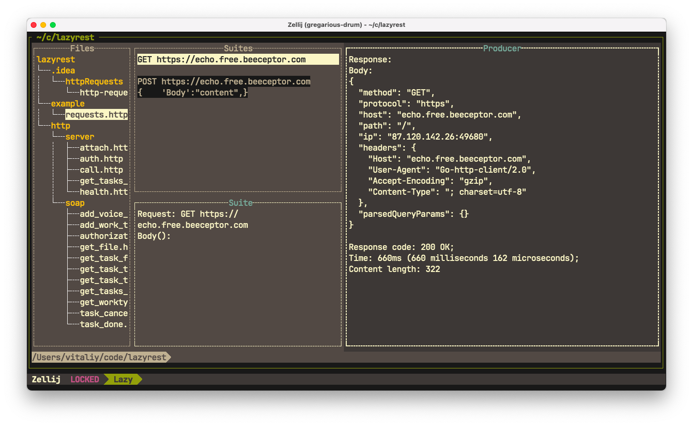

# lazyrest
## Parse `.http` files with Tree-sitter and send http requests.

### Preview




### MacOs build for windows:

```
brew install mingw-w64
env GOOS="windows" GOARCH="amd64" CGO_ENABLED="1" CC="x86_64-w64-mingw32-gcc" go build
```

### Navigation
- [x] Mouse support
- [x] `q` or `Ctrl+C` for close program
- [x] `j` & `k` file navigation
- [x] `j` & `k` Suite area scroll
- [x] `j` & `k` Producer area scroll
- [x] `Enter` for select and go next
- [x] `Esc` for go back

### TODO
- [ ] `j` & `k` Suites navigation
- [ ] `Ctrl+h/j/k/l` navigation
- [ ] Update Footer area when suite select
- [ ] Search files
- [ ] Search in text for Suite & Produce areas
