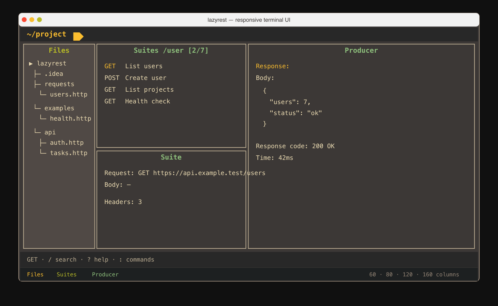
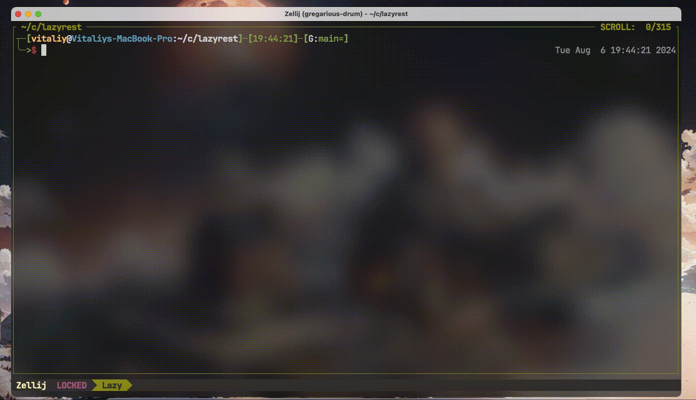

 # lazyrest

[](https://github.com/Hecatoncheir/lazyrest/actions/workflows/go-test.yml)
[](LICENSE)

`lazyrest` is a terminal UI for discovering and running requests from `.http` and `.hurl` files.

## Preview





[Watch the full MOV preview](preview.mov)

## Features

- Immediate TUI startup with background environment loading and recursive `.http` / `.hurl` discovery.
- Pure Go, with no CGO and no external parser: `go install` and cross-compilation need nothing but the Go toolchain.
- A dedicated diagnostics window and named requests.
- Public/private environment profiles plus recursive `{{variable}}` substitution.
- Cancellable HTTP and Hurl execution with animated Producer/footer progress bars, timeout, and bounded response bodies.
- GraphQL requests encoded the way servers expect, with a variables block and errors surfaced from `200` responses.
- Response headers, protocol metadata, and Pretty/Raw JSON or XML bodies with syntax highlighting.
- Syntax highlighting in the Suites, Suite, and Producer panes, coloured by the active theme.
- HTTP methods coloured by what they do, so the request list can be read at a glance.
- File/request/response search and an in-memory history of the last 50 runs.
- Mouse and Vim-style keyboard navigation.

## Requirements

- Go 1.25 or newer when building from source.
- The [`hurl`](https://hurl.dev/docs/installation.html) executable for `.hurl` files. It is not required for ordinary `.http` requests.

## Installation

Prebuilt archives for Linux, macOS, and Windows are attached to every
[release](https://github.com/Hecatoncheir/lazyrest/releases). Download the one
matching your platform, verify it against `SHA256SUMS`, and put `lazyrest` on
your `$PATH`:

```sh
tar -xzf lazyrest-linux-amd64.tar.gz && sudo install lazyrest /usr/local/bin/
```

macOS builds are not notarized, so the first launch needs
`xattr -d com.apple.quarantine lazyrest`.

Or install from source, which needs nothing but the Go toolchain:

```sh
go install github.com/Hecatoncheir/lazyrest@latest
```

Or build the repository locally:

```sh
go build -o lazyrest .
```

The build is pure Go, so cross-compiling asks for no C toolchain:

```sh
env GOOS=windows GOARCH=amd64 go build
```

## Neovim and LazyVim

Install `lazyrest` first and make sure the executable is available in Neovim's `$PATH`:

```sh
go install github.com/Hecatoncheir/lazyrest@latest
```

### Neovim

The following configuration opens `lazyrest` in a terminal tab, using the nearest Git repository or Go module as its root. Add it to `init.lua`:

```lua
local function open_lazyrest()
  local root = vim.fs.root(0, { ".git", "go.mod" }) or vim.fn.getcwd()

  vim.cmd("tabnew")
  local job = vim.fn.jobstart({ "lazyrest", root }, {
    cwd = root,
    term = true,
  })
  if job <= 0 then
    vim.notify("Unable to start lazyrest; check $PATH", vim.log.levels.ERROR)
    vim.cmd("tabclose")
    return
  end
  vim.cmd("startinsert")
end

vim.api.nvim_create_user_command("LazyRest", open_lazyrest, {})
vim.keymap.set("n", "<leader>Rl", open_lazyrest, { desc = "LazyRest" })
```

Run `:LazyRest` or press `<leader>Rl`. Use `<C-\\><C-n>` to leave terminal mode and `:tabclose` to close the tab after `lazyrest` exits.

### LazyVim

LazyVim includes `snacks.nvim`, whose terminal can toggle the same process in a floating window. Create `~/.config/nvim/lua/plugins/lazyrest.lua`:

```lua
return {
  {
    "folke/snacks.nvim",
    keys = {
      {
        "<leader>Rl",
        function()
          local root = vim.fs.root(0, { ".git", "go.mod" }) or vim.fn.getcwd()
          Snacks.terminal.toggle({ "lazyrest", root }, {
            cwd = root,
            start_insert = true,
          })
        end,
        desc = "LazyRest",
      },
    },
  },
}
```

The mapping follows LazyVim's REST key namespace. While lazyrest is in Terminal
mode, `Ctrl+h/j/k/l` are sent to the TUI. Use `<C-\\><C-n>` first when you want
those keys to control Neovim windows instead.

To select an environment profile, place its flags before the directory in either example:

```lua
{ "lazyrest", "-env", "development", root }
```

## Usage

```sh
lazyrest [flags] [directory]
```

When the directory is omitted, the current working directory is used.

```text
-timeout duration         request and Hurl timeout (default 30s)
-max-response-bytes int   maximum response bytes kept in memory (default 10485760)
-hurl string              Hurl executable name or path (default "hurl")
-env string               environment profile name
-env-file string          public environment file (default "http-client.env.json")
-private-env-file string  private environment file (default "http-client.private.env.json")
-version                  print the version and exit
-max-redirects int        maximum redirects a request follows (default 10)
-follow-redirects         follow redirects instead of returning them (default true)
-insecure                 accept any server certificate
-cookies                  carry cookies from one request to the next (default true)
```

Example `.http` file:

```http
@host = "api.example.com"
@token = "development-token"

# @name List users
GET https://{{host}}/users
Authorization: Bearer {{token}}
Accept: application/json
```

A request body can be read from a file next to the `.http` file. Variables inside the file are substituted as usual:

```http
POST https://{{host}}/users
Content-Type: application/json

< ./payload.json
```

Sensitive headers such as `Authorization`, cookies, API keys, tokens, and secrets are redacted from the response pane.

Cookies a server sets are carried into the requests that follow, so a login
request holds a session for the rest of the run. The jar lives in memory only
and is dropped when lazyrest exits; `-cookies=false` turns it off. Redirects are
followed up to `-max-redirects`, and `-follow-redirects=false` returns the
redirect itself so that its `Location` can be read. `-insecure` accepts any
certificate, for a host serving a self-signed one.

### GraphQL

A request is treated as GraphQL when its body is a GraphQL document or when it
carries `X-REQUEST-TYPE: GraphQL`. Write the query, then an optional JSON object
of variables after a blank line:

```http
POST https://{{host}}/graphql
X-REQUEST-TYPE: GraphQL

query GetUser($id: ID!) {
  user(id: $id) { name }
}

{
  "id": "{{userId}}"
}
```

lazyrest sends this as `application/json` with a `{"query": …, "variables": …}`
body, which is what the GraphQL over HTTP specification requires and what
servers accept. When the document names exactly one operation, its name is sent
as `operationName`.

GraphQL answers with `200` even when the operation failed, so an `errors` array
in the response is listed separately and marks the run as failed. To send the
raw query instead, declare `Content-Type: application/graphql` yourself.

## Chaining requests

A request can use what an earlier one answered. Name the first request, run it,
then refer to its response:

```http
# @name login
POST https://api.example.com/auth
Content-Type: application/json

{"user": "me", "password": "secret"}

###

GET https://api.example.com/profile
Authorization: Bearer {{login.response.body.$.token}}
```

`{{name.response.body.$.path}}` reads a value out of a JSON body, with member
names and array indices under a `$` root, such as
`{{login.response.body.$.data.items[0].id}}`. A string is inserted as itself and
anything else as its JSON form. `{{name.response.body}}` takes the whole body,
and `{{name.response.headers.X-Token}}` takes a response header.

References are resolved when the request runs, against the last answer of each
named request in the current session. Nothing is stored on disk. A request whose
references cannot be resolved is not sent; the pane says which reference was
waiting and why.

## Environments

Select a profile with `lazyrest -env development .`. Public values come from `http-client.env.json`:

```json
{
  "development": {
    "host": "api.example.com",
    "api": { "version": "v1" },
    "baseUrl": "https://{{host}}/{{api.version}}"
  }
}
```

Put secrets in `http-client.private.env.json`, which is ignored by Git:

```json
{
  "development": { "token": "local-secret" }
}
```

Use the values as `{{baseUrl}}` or `{{token}}` in `.http` files. They are also handed to Hurl through a private file, so `.hurl` files can use the same variables. Private values override public ones, while declarations inside an `.http` file override both. Undefined variables and reference cycles appear as parser diagnostics. Private values are redacted from requests, responses, errors, and history output.

## Examples

The [`example`](example) directory contains ready-to-run `.http` and `.hurl`
files with named requests, variables, different body formats, assertions, and
a multi-request Hurl workflow:

```sh
go run . example
```

The examples use the public `https://httpbin.org` test service and require
internet access. Running `.hurl` examples also requires the `hurl` executable.

A `.hurl` file is listed one entry at a time. Hurl runs a file in order and an
entry may use what an earlier one captured, so selecting an entry runs the file
up to it with `--to-entry`; the last entry therefore runs the whole file.

## Configuration

lazyrest merges configuration in this order, with later layers taking priority:

1. Built-in defaults.
2. `~/.config/lazyrest/config.yml`.
3. `.lazyrest.yml` in the selected project root.
4. The file passed with `--config`.

Each action accepts one or more keys. Configured keys replace the defaults for that action; actions omitted from the file keep their default bindings. Reusing a key in separate panels is allowed, while conflicting actions in the same context fail validation with an actionable error.

```yaml
language: zh

theme:
  preset: catppuccin-mocha
  accent: "#89b4fa"

languages:
  en:
    files: "Files"
    suites: "Suites"
    producer: "Producer"
    success: "Success"
    failed: "Failed"
  ru:
    files: "Файлы"
    suites: "Запросы"
    producer: "Результат"
    success: "Успешно"
    failed: "Ошибка"
  es:
    files: "Archivos"
    suites: "Solicitudes"
    producer: "Resultado"
    success: "Correcto"
    failed: "Error"
  zh:
    files: "文件"
    suites: "请求列表"
    producer: "响应"
    success: "成功"
    failed: "失败"

keybindings:
  help: ["?", "f1"]
  diagnostics: ["d"]
  quit: ["q", "ctrl+c"]
  focus_left: ["ctrl+h"]
  focus_down: ["ctrl+j"]
  focus_up: ["ctrl+k"]
  focus_right: ["ctrl+l"]
  open: ["enter", "o"]
  run: ["enter", "r"]
  back: ["esc"]
  search: ["/"]
  search_finish: ["enter", "esc"]
  search_next: ["n"]
  search_previous: ["N"]
  reload: ["r"]
  move_down: ["j"]
  move_up: ["k"]
  toggle_body: ["p"]
  history_previous: ["["]
  history_next: ["]"]
  command_palette: [":", "ctrl+p"]
  reload_config: ["ctrl+r"]
```

The built-in languages are English (`en`), Russian (`ru`), Spanish (`es`), and Simplified Chinese (`zh`). The `languages` section is optional and overrides individual built-in strings. Missing strings fall back to the selected built-in language and then to English. A new language can be added by defining it under `languages` and selecting its code with `language`.

Syntax highlighting takes its colours from the same palette, so it matches
whichever preset or override is active. It covers the body preview in Suites,
the request in Suite, and the request and response in Producer. Bodies over
256 KiB are shown without highlighting to keep the panes responsive.

The built-in theme presets are `gruvbox` (default), `catppuccin-mocha`, `tokyo-night`, `dracula`, `nord`, and `monokai`. Every theme color remains an optional hexadecimal RGB override applied on top of the selected preset. Choose **Choose theme** from the command palette to switch the current session immediately. Press `Ctrl+r` or choose **Reload configuration** to apply language, translations, keybindings, and theme changes from configuration without restarting lazyrest. Invalid configuration leaves the current settings active and displays an error in the footer.

Supported named keys are `enter`, `esc`, `backspace`, `tab`, arrow keys, `home`, `end`, `pgup`, `pgdn`, `f1` through `f12`, and `ctrl+a` through `ctrl+z`. Single non-whitespace printable characters are case-sensitive.

Configuration CLI commands:

```sh
lazyrest --generate-config
lazyrest --print-config /path/to/project
lazyrest --validate-config /path/to/project
lazyrest --config ./team.yml /path/to/project
lazyrest --config ./custom.yml --generate-config
```

`--generate-config` creates a complete configuration with permissions `0600` and refuses to overwrite an existing file. `--print-config` prints the resolved layered configuration. `--validate-config` checks YAML, colors, languages, key names, and contextual key conflicts without starting the TUI.

## Persistent history

The latest 50 request results are stored in `~/.config/lazyrest/history.json` and restored on the next launch. Bodies are limited to 64 KiB per entry in the file, while the response pane keeps the full body of the current session. Writing happens in the background, so a large response does not stall the interface. Known secret values and sensitive headers such as `Authorization`, cookies, and API keys are redacted before writing. The directory uses permissions `0700`, the history file uses `0600`, and updates are atomic. Delete the file to clear persistent history.

## Navigation

- `j` / `k` or arrows: move and scroll.
- `Enter`: select a file/request or execute the selected request.
- `Esc`: go back; in the response pane it also cancels the active run.
- `Ctrl+h/j/k/l`: move between areas according to the following map:

| Focused area | Shortcut | Destination |
| --- | --- | --- |
| Files | `Ctrl+l` | Open the selected file in Suites |
| Suites | `Ctrl+h` | Files |
| Suites | `Ctrl+j` | Suite |
| Suites | `Ctrl+l` | Producer |
| Suite | `Ctrl+h` | Files |
| Suite | `Ctrl+k` | Suites |
| Suite | `Ctrl+l` | Producer |
| Producer | `Ctrl+h` | Suite |

- `/`: search in the focused Files, Suites, or Producer area; `Enter` finishes entering the query.
- `r`: reload the file tree in the background while Files is focused.
- `p`: toggle Pretty/Raw response bodies while Producer is focused. Pretty formats and highlights JSON, XML, and GraphQL; Raw shows exactly what came over the wire.
- `n` / `N`: next/previous matching file.
- `[` / `]`: previous/next response history entry.
- `d`: open parser, startup, and file-discovery diagnostics; press `d`, `q`, or `Esc` to close.
- `?`: open the built-in keyboard reference; press `?`, `q`, or `Esc` to close.
- `:` or `Ctrl+p`: open the command palette.
- `Ctrl+r`: reload `~/.config/lazyrest/config.yml` without restarting.
- `q` or `Ctrl+C`: quit.

## Development

```sh
go test ./...
go test ./ui -run TUI
go vet ./...
go build ./...
```
